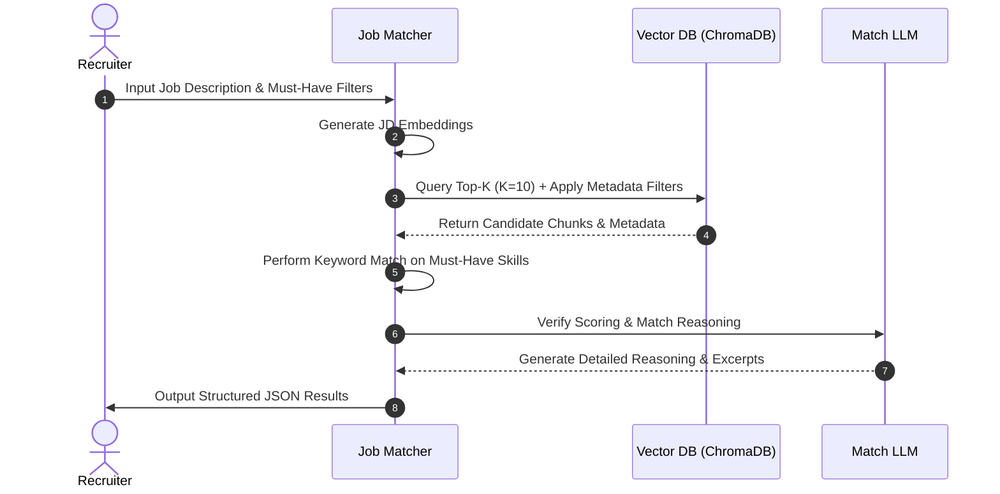

# RAG-Based Profile Matching System: Architecture Design

This document details the system architecture, component design, data flow, and database schemas for the AI-Powered Resume Matching Engine.

---

## 1. System Overview

The system consists of two primary pipelines: the **Ingestion Pipeline** (Part A: RAG System Setup) and the **Retrieval & Matching Pipeline** (Part B: Job Matching Engine). 

```mermaid
graph TD
    subgraph Ingestion Pipeline (Part A)
        A[Resumes: PDF/DOCX/TXT] --> B[Milestone 1 File Reader]
        B --> C[Section-Aware Chunking]
        C --> D[Metadata Extraction Engine]
        D --> E[(Vector Database: ChromaDB)]
        C --> E
    end

    subgraph Query & Matching Engine (Part B)
        F[Job Description] --> G[Embedding Generator]
        G --> H[Hybrid Searcher]
        E --> H
        H --> I[Constraint Filter & Scorer]
        I --> J[JSON Output Matches]
    end
    
    style E fill:#f9f,stroke:#333,stroke-width:2px
    style J fill:#bbf,stroke:#333,stroke-width:2px
```

---

## 2. Part A: Ingestion Pipeline & Database Schema (`resume_rag.py`)

The ingestion pipeline handles parsing, chunking, metadata extraction, and vector storage.

### 2.1 Document Ingestion & Chunking
* **Parser:** Uses the sandboxed parser (`fs_tools.py` from Milestone 1) supporting `.pdf`, `.docx`, and `.txt` file formats.
* **Intelligent Chunking Strategy:** Resumes are semi-structured documents. Standard length-based chunking can break sections (e.g., separating a job title from its responsibilities). The chunking strategy will:
  1. Detect section headers using regular expressions (e.g., `EXPERIENCE`, `EDUCATION`, `SKILLS`, `PROJECTS`).
  2. Split the document into section-based chunks.
  3. If a section is excessively long, apply a secondary character/token chunking with overlap (e.g., 500 characters with 100 character overlap) to preserve local context.

### 2.2 LLM-Assisted Metadata Extraction
For every resume, the pipeline runs a structural parser (using OpenAI/compatible LLM) to extract a structured schema of candidate metadata:
```json
{
  "name": "Candidate Name",
  "skills": ["Skill 1", "Skill 2"],
  "experience_years": 5.5,
  "education": [
    {
      "degree": "Bachelor of Science",
      "major": "Computer Science",
      "institution": "University X"
    }
  ]
}
```

### 2.3 Vector Database Schema (ChromaDB)
ChromaDB stores the text chunks, vector embeddings, and associated metadata.

* **Collection Name:** `resume_collection`
* **Embedding Model:** `text-embedding-nomic-embed-text-v1.5` (via local LM Studio server at `http://localhost:1234/v1`)
* **LLM Engine:** `google/gemma-4-e4b` (via local LM Studio server at `http://localhost:1234/v1`)
* **Metadata Fields (Stored per chunk for retrieval filtering):**
  * `candidate_name` (string)
  * `resume_path` (string)
  * `skills` (comma-separated string for compatibility with metadata filters)
  * `experience_years` (float)
  * `education` (stringified JSON or highest degree achieved)
  * `section_type` (string: e.g., `skills`, `experience`, `education`, `general`)

---

## 3. Part B: Job Matching Engine (`job_matcher.py`)

The job matcher evaluates a Job Description (JD) against candidate profiles stored in the vector database.

### 3.1 Retrieval & Hybrid Search Flow



### 3.2 Hybrid Search Algorithm
Hybrid search combines semantic similarity with deterministic checks:
1. **Semantic Querying:** The JD text is converted into an embedding and queried against the vector database to retrieve the top 10 matching candidate documents.
2. **Metadata Constraints (Hard Filters):** Filters are applied during the query phase or as a post-processing step:
   * **Experience Filter:** Exclude profiles where `experience_years` < `min_experience_required`.
   * **Must-Have Skills:** Filter out candidates who do not possess crucial skills (e.g., "Python" or "Kubernetes").

### 3.3 Scoring & Ranking Model
A final match score (0-100) is calculated for each candidate based on a weighted combination of factors:

$$\text{Final Score} = (\text{Semantic Score} \times 0.6) + (\text{Skill Match Score} \times 0.3) + (\text{Experience Score} \times 0.1)$$

* **Semantic Score (60% weight):** Cosine similarity between the job description embedding and candidate resume chunks.
* **Skill Match Score (30% weight):** Ratio of matched skills from the job description to the candidate's extracted skills list.
* **Experience Score (10% weight):** A scoring system based on experience proximity (capped at 100% if candidate exceeds the requested years).

### 3.4 LLM Match Evaluation & Output Generation
For the top candidates, the LLM reviews the retrieved chunks and the job description to:
1. Identify relevant excerpts demonstrating their qualifications.
2. Formulate a natural language reasoning explanation justifying the score.
3. Validate the output format against the expected JSON schema.

---

## 4. API & CLI Interface

### CLI Execution Example
```bash
python job_matcher.py --jd "Looking for a Senior Backend Developer with 5+ years of Python and Django experience." --min-experience 5 --skills "Python,Django"
```

### Output JSON Format
```json
{
  "job_description": "Looking for a Senior Backend Developer with 5+ years of Python and Django experience.",
  "top_matches": [
    {
      "candidate_name": "Alice Smith",
      "resume_path": "resumes/alice_smith.pdf",
      "match_score": 94,
      "matched_skills": ["Python", "Django", "PostgreSQL"],
      "relevant_excerpts": [
        "Lead Backend Engineer with 6 years of experience building Python APIs using Django.",
        "Optimized database queries for Django/PostgreSQL stack, reducing load times by 40%."
      ],
      "reasoning": "Alice is a highly strong match with over 6 years of backend experience, specifically emphasizing Python and Django. Her background in database optimization directly aligns with backend requirements."
    }
  ]
}
```
